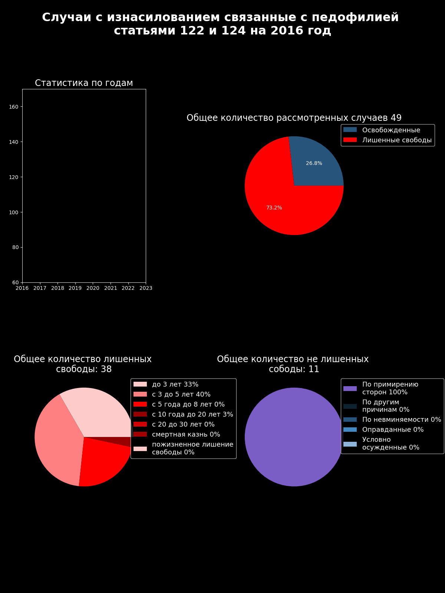

# sexual-harassment-under-age-16

## Installation

Clone the repository
```shell
$ git clone https://github.com/open-data-kazakhstan/sexual-harassment-under-age-16.git
```

Requires Python 3.11.3 

Create a virtual environment and activate it 
```bash
pip install venv
python -m venv /path/to/localrepo
```

Swicth to venv directory by using cd comand
```bash
cd /path/to/localrepo
Scripts/activate
```

Install dependecies in venv by using pip
```bash
pip install -r requirements.txt
```

Run the project:
```bash
python scripts/main.py
```
## Data 

Basic data dowhnloded from sourse: https://qamqor.gov.kz/crimestat/statistics

Data was preprocessed and placed in folder archive as file data_imp.csv

Additional changes was added and final csv file located in folder csv_wrang.csv 

We have processed the source data to make it normalized and derived  several aggregated datasets from it:

* `archive/data_imp.csv` - sourсe data for salaries
* `data/csv_wrang.csv` - wranged and preprocessed data
* `datapackage.json` - conatins all of the key information about our dataset

## Scripts

* `wrang.py`- cleaning and wranging the source data script
* `animate.py` - uses matplotlib to dashboards on based data
* `datapack.py` - creating datapckage.json file that conatinsall meatadata
* `main.py` - launches all scripts step by step

## Visualization

Final result is visualized data that displays average salary and inflation data




## License

This dataset is licensed under the Open Data Commons [Public Domain and Dedication License][pddl].

[pddl]: https://www.opendatacommons.org/licenses/pddl/1-0/